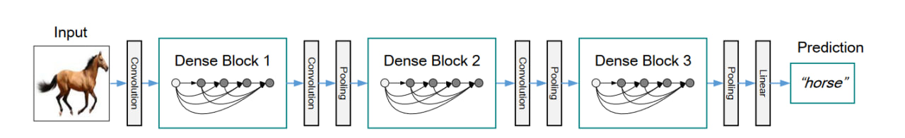

## Creating DenseNet Networks(DenseNet121, DenseNet169, DenseNet201 and DenseNet264) with Tensorflow
In this repository, we will look at how to create DenseNet architectures from scratch using Tensorflow.

    

This Figure: A 5-layer dense block with a growth rate of k = 4. Each layer takes all preceding feature-maps as input.

    

This image: A deep DenseNet with three dense blocks. The layers between two adjacent blocks are referred to as transition layers and change feature-map sizes via convolution and pooling.

#### Building The DenseNet Networks

- DenseNet (Dense Convolutional Network) is a type of deep learning architecture that has gained popularity due to its ability to mitigate the vanishing gradient problem and improve the flow of information across the network. It was introduced in the paper "Densely Connected Convolutional Networks" by Gao Huang, Zhuang Liu, and Kilian Q. Weinberger in 2017.

- One of the key advantages of DenseNet is that it promotes feature reuse by connecting all layers directly with each other in a dense way. In traditional convolutional neural networks (CNNs), each layer is connected only to the next layer, resulting in a deep but relatively narrow network. DenseNet, on the other hand, connects each layer to every subsequent layer, resulting in a dense and deep network. This creates a more efficient flow of information, allowing the network to extract features more effectively and with fewer parameters.

- Another advantage of DenseNet is that it requires less memory compared to traditional CNNs, which makes it suitable for deep learning tasks on smaller datasets or on hardware with limited memory capacity.

- Due to these advantages, DenseNet has been successfully applied to a wide range of computer vision tasks, such as image classification, object detection, segmentation, and more.

#### GoogLeNet network with all the bells and whistles
.png)

I am trying to build this architecture of the GoogLeNet via tensorflow framework from scratch. More at the <a href= "https://github.com/makhmudjumanazarov/Inception-V1-GoogleNet-Architecture-via-Tensorflow/blob/main/Inception%20V1.ipynb">link below</a>...

